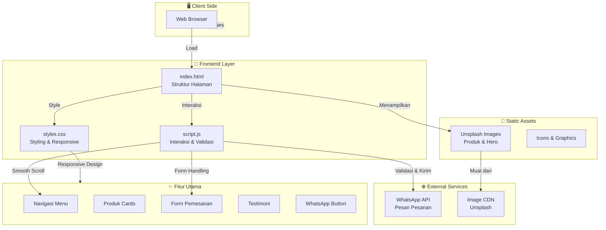

# Arsitektur Anggara Local Beef Website

## Diagram Arsitektur Sistem

## Komponen Utama

### 1. Frontend Layer
- **HTML (index.html)**: Struktur semantic HTML5 dengan 8 section utama
- **CSS (styles.css)**: Responsive design dengan mobile-first approach
- **JavaScript (script.js)**: Event handling dan form validation

### 2. Fitur-Fitur Utama

#### Header & Navigation
- Sticky navigation untuk kemudahan akses
- Logo Anggara Local Beef
- Menu navigasi dengan smooth scroll

#### Hero Section
- Full-screen hero dengan background image
- Call-to-action button
- Animation effects

#### Products Section
- 4 produk unggulan dalam grid layout
- Card dengan hover effect
- Responsive design

#### Order Form Section
- Input: Nama, WhatsApp, Produk, Jumlah, Catatan
- Integrasi WhatsApp API
- Form validation

### 3. External Services
- **WhatsApp API**: Integrasi untuk mengirim pesanan
- **Unsplash CDN**: Gambar produk dan hero section

## Technology Stack

| Layer | Technology | Alasan |
|-------|-----------|--------|
| Frontend | HTML5 | Semantic & SEO friendly |
| Styling | CSS3 | Responsive design, animations |
| Interaksi | Vanilla JavaScript | Lightweight, no dependencies |
| Images | Unsplash CDN | Free, high quality |
| Messaging | WhatsApp API | Direct customer communication |
| Hosting | GitHub Pages / Static | Simple & cost-effective |

## Features Highlights

✅ Responsive Design - Mobile, tablet, desktop
✅ Fast Loading - Optimized images & CDN
✅ User Friendly - Intuitive navigation
✅ Direct Messaging - WhatsApp integration
✅ No Database - Static HTML, CSS, JS
✅ Easy to Maintain - Simple file structure
✅ SEO Friendly - Semantic HTML
✅ Modern UI - Card-based design, animations